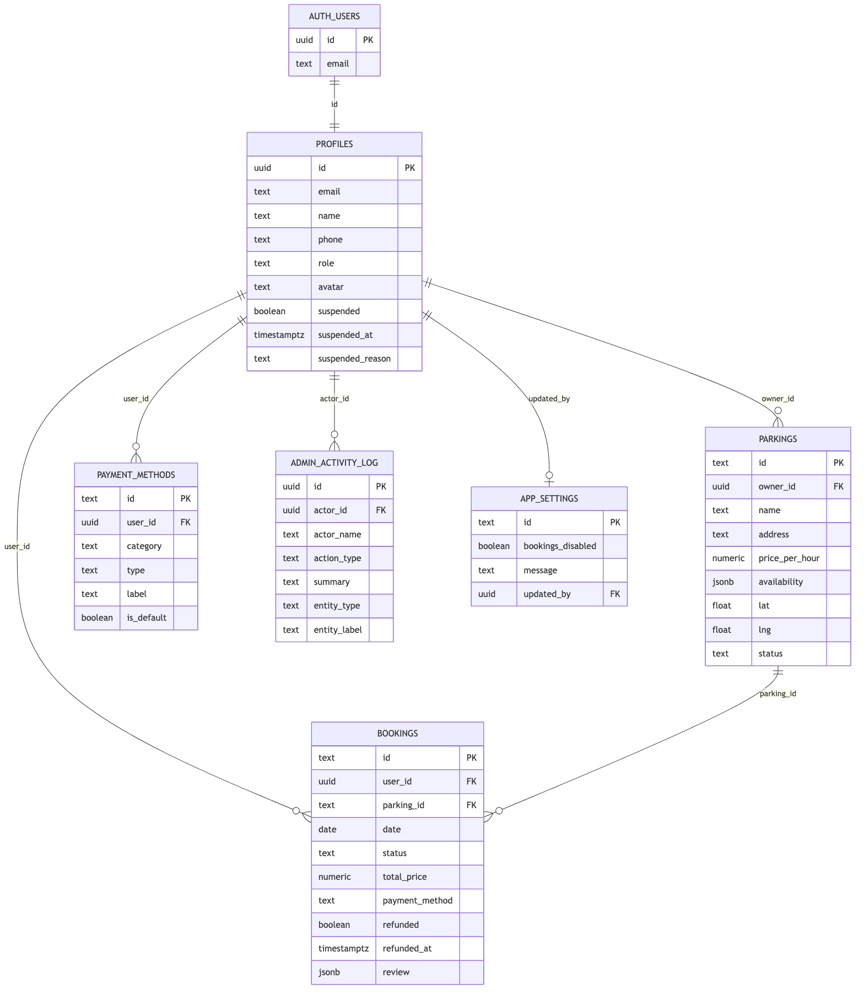
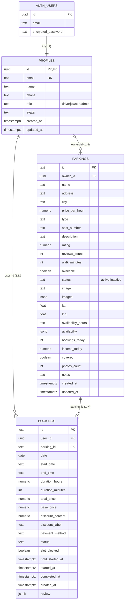

# Parkit — מודל נתונים (ERD)

דיאגרמת יחסים ישויות (ERD) התואמת את המיגרציות ב־`supabase/migrations/`.

**מקור אמת:** `20260708180000_initial_schema.sql`

---

## דיאגרמה

---

## קשרים

| מ | אל | סוג | שדה | ON DELETE |
|---|-----|-----|-----|-----------|
| `auth.users` | `profiles` | 1:1 | `profiles.id` → `auth.users.id` | CASCADE |
| `profiles` | `parkings` | 1:N | `parkings.owner_id` → `profiles.id` | CASCADE |
| `profiles` | `bookings` | 1:N | `bookings.user_id` → `profiles.id` | CASCADE |
| `parkings` | `bookings` | 1:N | `bookings.parking_id` → `parkings.id` | CASCADE |

---

## טבלאות

### `profiles`
פרופיל משתמש — נוצר אוטומטית ב-trigger `handle_new_user()` בעת הרשמה ב-Supabase Auth.

| שדה | טיפוס | הערות |
|-----|--------|--------|
| `id` | UUID PK | זהה ל־`auth.users.id` |
| `email` | TEXT UNIQUE | |
| `name`, `phone` | TEXT | |
| `role` | TEXT | `driver` / `owner` / `admin` |
| `avatar` | TEXT | URL או base64 |

### `parkings`
חניה שמפורסמת על ידי בעלים (`owner`).

| שדה | טיפוס | הערות |
|-----|--------|--------|
| `id` | TEXT PK | מזהה ידידותי (למשל `p1`) |
| `owner_id` | UUID FK → profiles | |
| `availability` | JSONB | לוח שבועי, תאריכים חסומים, משבצות תפוסות |
| `lat`, `lng` | DOUBLE | מיקום על המפה |
| `status` | TEXT | `active` / `inactive` (הקפאה) |

### `bookings`
הזמנת חניה על ידי נהג.

| שדה | טיפוס | הערות |
|-----|--------|--------|
| `id` | TEXT PK | |
| `user_id` | UUID FK → profiles | הנהג |
| `parking_id` | TEXT FK → parkings | |
| `status` | TEXT | `scheduled`, `pending_arrival`, `saved`, `active`, `completed`, `cancelled` |
| `review` | JSONB | `{ rating, text }` לאחר סיום |

---

## אינדקסים

- `parkings_owner_id_idx` — חיפוש חניות לפי בעלים
- `bookings_user_id_idx` — היסטוריית הזמנות לנהג
- `bookings_parking_id_idx` — הזמנות לחניה
- `bookings_status_idx` — סינון לפי מצב

---

## Row Level Security (RLS)

| טבלה | מדיניות עיקרית |
|------|----------------|
| `profiles` | SELECT/UPDATE לפרופיל עצמי בלבד |
| `parkings` | SELECT ציבורי לחניות `active`; בעלים רואה גם מוקפאות |
| `bookings` | SELECT להזמנות עצמיות + הזמנות על חניות של הבעלים |
| `bookings` | INSERT/UPDATE/DELETE להזמנה עצמית בלבד |
| `parkings` | INSERT/UPDATE/DELETE לבעלים בלבד |

פרטים מלאים: `supabase/migrations/` (3 קבצים, לפי סדר תאריך).

---

## מיפוי לאפליקציה

| DB (snake_case) | אפליקציה (camelCase) | קובץ |
|-----------------|----------------------|------|
| `profiles` | `user` | `supabaseMappers.js` → `profileFromRow` |
| `parkings` | `parking` | `parkingFromRow` / `parkingToRow` |
| `bookings` | `booking` | `bookingFromRow` / `bookingToRow` |

---

## הערות עיצוב

1. **`availability` ב-JSONB** — לוח זמינות גמיש (שבועי + overrides לפי תאריך + משבצות תפוסות) בלי טבלאות משנה נפרדות ב-MVP.
2. **`review` ב-JSONB** — ביקורת אחת להזמנה; מספיק לדרישות הפרויקט.
3. **`parkings.id` כ-TEXT** — תואם ל-seed ב-`mockData.js` ולמעבר חלק בין mock ל-Supabase.
