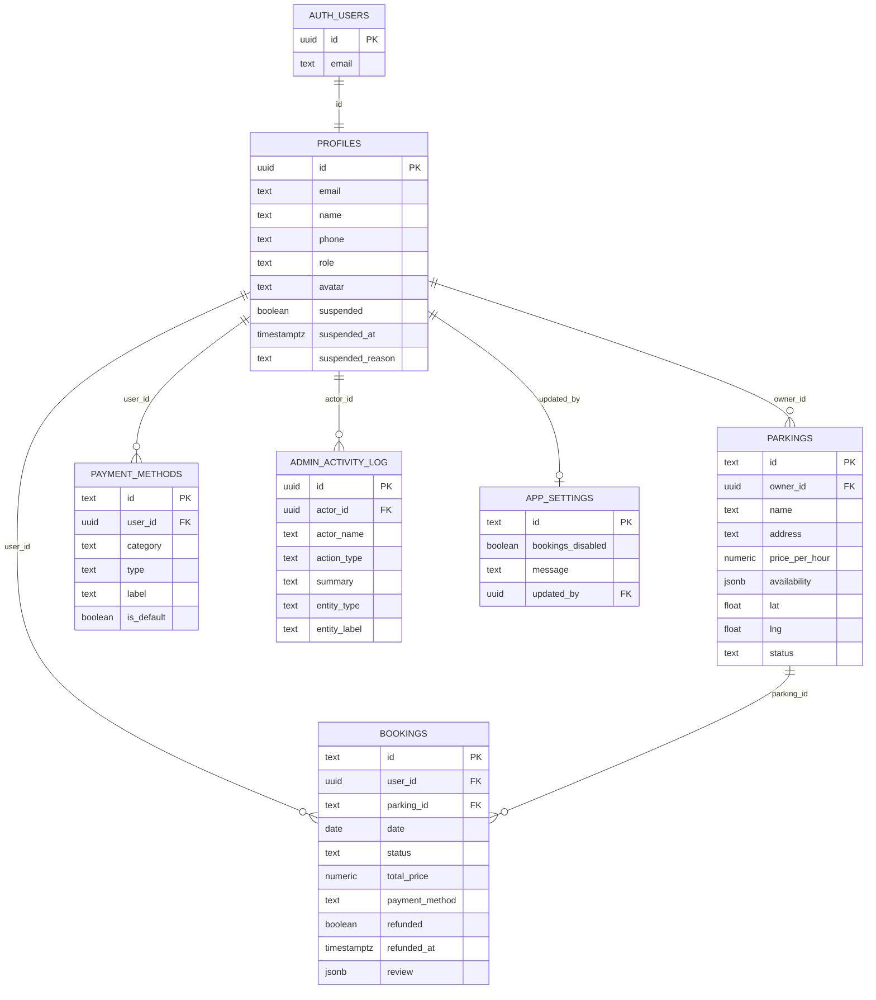

# Parkit — מודל נתונים (ERD)

דיאגרמת יחסים ישויות (ERD) התואמת את **כל** המיגרציות ב־`supabase/migrations/` (מצב סופי אחרי הרצה לפי סדר תאריך).

**מקור אמת:** כל קבצי ה־`.sql` בתיקייה — לא רק הסכמה ההתחלתית.

---

## דיאגרמה

---

## קשרים

| מ | אל | סוג | שדה | ON DELETE |
|---|-----|-----|-----|-----------|
| `auth.users` | `profiles` | 1:1 | `profiles.id` → `auth.users.id` | CASCADE |
| `profiles` | `parkings` | 1:N | `parkings.owner_id` → `profiles.id` | CASCADE |
| `profiles` | `bookings` | 1:N | `bookings.user_id` → `profiles.id` | CASCADE |
| `profiles` | `payment_methods` | 1:N | `payment_methods.user_id` → `profiles.id` | CASCADE |
| `profiles` | `admin_activity_log` | 0:N | `admin_activity_log.actor_id` → `profiles.id` | SET NULL |
| `profiles` | `app_settings` | 0:1 | `app_settings.updated_by` → `profiles.id` | SET NULL |
| `parkings` | `bookings` | 1:N | `bookings.parking_id` → `parkings.id` | CASCADE |

> `bookings.payment_method` הוא טקסט לתצוגה בלבד — **אין** FK ל־`payment_methods`.

---

## טבלאות

### `profiles`
פרופיל משתמש — נוצר אוטומטית ב-trigger `handle_new_user()` בעת הרשמה ב-Supabase Auth (כולל Google OAuth: `full_name` / `avatar_url`).

| שדה | טיפוס | הערות |
|-----|--------|--------|
| `id` | UUID PK | זהה ל־`auth.users.id` |
| `email` | TEXT UNIQUE | |
| `name`, `phone` | TEXT | |
| `role` | TEXT | `driver` / `owner` / `admin` — ננעל בהרשמה; שינוי רק דרך admin |
| `avatar` | TEXT | URL או base64 |
| `suspended` | BOOLEAN | השעיה ע״י מנהל |
| `suspended_at` | TIMESTAMPTZ | |
| `suspended_reason` | TEXT | |

### `parkings`
חניה שמפורסמת על ידי בעלים (`owner`).

| שדה | טיפוס | הערות |
|-----|--------|--------|
| `id` | TEXT PK | מזהה ידידותי (למשל `p1`) |
| `owner_id` | UUID FK → profiles | |
| `availability` | JSONB | לוח שבועי, תאריכים חסומים, משבצות תפוסות |
| `lat`, `lng` | DOUBLE | מיקום על המפה |
| `status` | TEXT | `active` / `inactive` (הקפאה) |

### `bookings`
הזמנת חניה על ידי נהג.

| שדה | טיפוס | הערות |
|-----|--------|--------|
| `id` | TEXT PK | |
| `user_id` | UUID FK → profiles | הנהג |
| `parking_id` | TEXT FK → parkings | |
| `status` | TEXT | `scheduled`, `saved`, `pending_arrival`, `active`, `completed`, `cancelled` |
| `payment_method` | TEXT | תווית תשלום (לא FK) |
| `refunded` / `refunded_at` | | סימון החזר ע״י מנהל |
| `review` | JSONB | `{ rating, text }` לאחר סיום |

### `payment_methods`
אמצעי תשלום לנהג / חשבון בנק לתשלומים לבעלים.

| שדה | טיפוס | הערות |
|-----|--------|--------|
| `category` | TEXT | `payment` / `payout` |
| `type` | TEXT | `credit_card` / `apple_pay` / `google_pay` / `bank_account` |
| `brand`, `last_four` | TEXT | לכרטיסים |
| `bank_name`, `bank_branch`, `account_holder_name` | TEXT | לחשבון בנק |

### `app_settings`
שורת הגדרות יחידה (`id = 'global'`) — הקפאת הזמנות / תחזוקה.

| שדה | טיפוס | הערות |
|-----|--------|--------|
| `bookings_disabled` | BOOLEAN | כבוי = אין הזמנות / ניהול חניות |
| `message` | TEXT | הודעה למשתמשים |
| `updated_by` | UUID FK | המנהל שעדכן אחרון |

### `admin_activity_log`
יומן פעולות מנהל (טקסט קריא בעברית).

| שדה | טיפוס | הערות |
|-----|--------|--------|
| `actor_id` / `actor_name` | | מי ביצע |
| `action_type` | TEXT | קבועים ב־`auditLog.js` |
| `summary` | TEXT | תיאור בעברית |
| `entity_type` / `entity_label` | TEXT | ישות קשורה (אופציונלי) |

---

## אינדקסים

- `parkings_owner_id_idx` — חיפוש חניות לפי בעלים
- `bookings_user_id_idx` — היסטוריית הזמנות לנהג
- `bookings_parking_id_idx` — הזמנות לחניה
- `bookings_status_idx` — סינון לפי מצב
- `payment_methods_user_id_idx` / `payment_methods_category_idx` — אמצעי תשלום לפי משתמש
- `admin_activity_log_created_at_idx` / `admin_activity_log_action_type_idx` — יומן מנהל

---

## פונקציות ו-triggers חשובים

| אובייקט | תפקיד |
|---------|--------|
| `handle_new_user()` + `on_auth_user_created` | יצירת/עדכון פרופיל בהרשמה; תפקיד רק `driver`/`owner` (לא `admin`); תומך בשדות Google |
| `prevent_profile_role_change()` | חוסם שינוי `role` למשתמש רגיל; מנהל מורשה |
| `is_admin()` | בדיקת תפקיד מנהל (SECURITY DEFINER) |
| `get_owner_parking_occupancy()` | תפוסה לבעלים **בלי** `user_id` / תשלום / ביקורת |
| `admin_delete_user(uuid)` | מחיקת משתמש מ־`auth.users` (cascade לפרופיל ונגזרות); לא עצמי / לא מנהל אחר |

---

## Row Level Security (RLS) — מצב סופי

| טבלה | מדיניות עיקרית |
|------|----------------|
| `profiles` | SELECT/UPDATE עצמי; מנהל רואה/מעדכן הכל |
| `parkings` | SELECT לחניות `active` (גם anon) או לבעלים; כתיבה לבעלים עם role `owner`/`admin`; מנהל CRUD מלא |
| `bookings` | SELECT/כתיבה להזמנה עצמית בלבד; מנהל CRUD מלא. בעלים משתמשים ב־RPC תפוסה |
| `payment_methods` | CRUD לבעלים של השורה בלבד — **בלי** גישת מנהל |
| `app_settings` | SELECT לכל authenticated; UPDATE למנהל בלבד |
| `admin_activity_log` | SELECT/INSERT למנהל בלבד |

פרטים מלאים: `supabase/migrations/` (12 קבצים, לפי סדר תאריך).

---

## מיפוי לאפליקציה

| DB (snake_case) | אפליקציה (camelCase) | קובץ |
|-----------------|----------------------|------|
| `profiles` | `user` / admin profiles | `supabaseMappers.js` → `profileFromRow` |
| `parkings` | `parking` | `parkingFromRow` / `parkingToRow` |
| `bookings` | `booking` | `bookingFromRow` / `bookingToRow` |
| `payment_methods` | payment method | `paymentMethodFromRow` / stores |
| `app_settings` | maintenance flag | `adminStore` / guards |
| `admin_activity_log` | audit entries | `auditLog.js` |

---

## הערות עיצוב

1. **`availability` ב-JSONB** — לוח זמינות גמיש (שבועי + overrides לפי תאריך + משבצות תפוסות) בלי טבלאות משנה נפרדות ב-MVP.
2. **`review` ב-JSONB** — ביקורת אחת להזמנה; מספיק לדרישות הפרויקט.
3. **`parkings.id` / `bookings.id` כ-TEXT** — תואם ל-seed ולמעבר חלק בין mock ל-Supabase.
4. **פרטיות בעלים** — בעל חניה רואה תפוסה בזמן, לא מי הזמין ומה שילם (`get_owner_parking_occupancy`).
5. **נעילת תפקידים** — הרשמה לא יכולה ליצור `admin`; שינוי role רק למנהל.
6. **מנהל בלי כרטיסים** — גישת admin רחבה לכל הטבלאות למעט `payment_methods`.
